<div align="center">

<picture>
  <source media="(prefers-color-scheme: dark)" srcset="assets/hero-dark.svg">
  <source media="(prefers-color-scheme: light)" srcset="assets/hero-light.svg">
  </picture>

# Your agents deserve _exact evidence._

**Star us ❤️ →** [Smritikosh on GitHub](https://github.com/learncoder4848/smritikosh) ·
[PyPI](https://pypi.org/project/smritikosh/) ·
[Benchmarks](#benchmarks) ·
[Issues](https://github.com/learncoder4848/smritikosh/issues)

Smritikosh is a local-first indexing and retrieval tool for code, documents, and conversations.
It incrementally indexes changes and returns precise, line-cited passages for agents—without
API keys, hosted vector databases, or sending source data off-device.

**Precise** · line-level citations &nbsp;·&nbsp; **Incremental** · indexes only changes &nbsp;·&nbsp; **Local** · no API keys or cloud

[](https://github.com/learncoder4848/smritikosh/actions/workflows/ci.yml)
[](https://pypi.org/project/smritikosh/)
[](https://pypi.org/project/smritikosh/)
[](https://www.python.org/)
[](LICENSE)
[](#status)

</div>

## Get started

No Python on the machine? `uv` brings its own.

```bash
curl -LsSf https://astral.sh/uv/install.sh | sh   # Windows: docs.astral.sh/uv
uv tool install smritikosh
```

Or `pipx install smritikosh`. Where the command is missing from PATH, `python -m smritikosh`
is the same thing.

**Index whatever the agent should know.** It all lands in one `./smritikosh.duckdb` and is
searched as a single corpus.

```bash
smritikosh index ./auth-svc        # one repository, or fifty — repeat per repo
smritikosh index ./docs            # Markdown and MDX beside the code
smritikosh index ./slack-export    # Slack threads and .docx — soon
```

**Then let the agent explore.** `explore tools` hands it the workflow and the citation
contract, `search` returns locations, `chunks` reads only those ranges.

```bash
smritikosh explore tools
smritikosh explore search "authorization decision flow" "authorization tests"
smritikosh explore chunks --range src/auth/policy.py 176 193
```

Re-run `index` anytime — unchanged files are skipped, so only the Δ costs anything.
Add `--watch` to keep it live while you work.

## Retrieval — _built for agents, not for humans scrolling_

<picture>
  <source media="(prefers-color-scheme: dark)" srcset="assets/hybrid-retrieval-dark.svg">
  <source media="(prefers-color-scheme: light)" srcset="assets/hybrid-retrieval-light.svg">
  </picture>

Ask one question as four facets — primary flow, state or data, failure handling, tests. Each
facet is retrieved independently from local embeddings **and** an incremental Okapi BM25 index,
so meaning and exact identifiers both land. Reciprocal Rank Fusion merges the rankings, facet
reservation keeps every angle represented, Maximal Marginal Relevance drops near-duplicates,
and survivors expand to complete definitions plus one bounded direct-reference hop.

Results arrive as [TOON](https://toonformat.dev) — columns declared once, then one row each:

```text
queries[4]{id,query}:
  Q1,authorization decision flow
  Q2,authorization policy state and inputs
  Q3,authorization failure handling
  Q4,authorization tests
search_results[3]{path,start_line,end_line,symbol,facets}:
  src/auth/permissions.py,59,81,PermissionChecker,Q1|Q3
  src/auth/policy.py,176,193,evaluate,Q1
  tests/auth/test_policy.py,14,38,test_denies_expired_grant,Q4
```

`search` returns locations only. Copy a row straight into `chunks --range PATH START END` to
rebuild that source with stable line numbers, repeating `--range` to read several spans in one
process. `chunks PATH` outlines what a file defines; `--prose` switches either command to
human-readable output.

## Why _incremental?_

<picture>
  <source media="(prefers-color-scheme: dark)" srcset="assets/incremental-dark.svg">
  <source media="(prefers-color-scheme: light)" srcset="assets/incremental-light.svg">
  </picture>

An index that goes stale is a liability: the agent cites line numbers that moved. Smritikosh
compares file hashes, re-parses only what changed, retires stale chunks, and reuses existing
content vectors — so keeping an index fresh costs a fraction of building it. Add `--watch` and
it stays synchronized while you work.

## What Smritikosh offers

| | |
| --- | --- |
| **One index, many sources** | Point `index` at each repository and docs tree in turn; they share one database and are searched as a single corpus, so an answer can cite two services and a design doc at once. |
| **Agent-ready exploration** | `explore tools` teaches the model how to search, verify, cite, and stop. `search` finds candidates, `chunks` reads only the selected ranges. |
| **Hybrid search** | Dense vectors for meaning, BM25 for identifiers, RRF for fusion, facet reservation for coverage, MMR for diversity. |
| **Definition-aligned evidence** | Tree-sitter queries keep classes, functions, and methods whole, so a range is always a complete thought. |
| **Δ incremental re-indexing** | SHA-256 file skipping, chunk-level memoization, stale-chunk retirement, optional `--watch`. |
| **Local and read-only** | Source, metadata, vectors, BM25 postings, and incremental state live in one DuckDB file. Exploration never takes a write lock or touches the source tree. |
| **Multi-language** | AST-aware indexing for Python, TypeScript, JavaScript, Java, and Kotlin; structure-aware strategies for Markdown, MDX, JSON, and TOML. |

## What can you _build?_

- **Code-aware agents** that retrieve the exact implementation and its tests before answering.
- **Production-triage assistants** that trace ownership, events, gates, and failure paths across indexed services.
- **Architecture discovery tools** that map definitions and direct references without loading whole repositories into context.
- **Repository Q&A** whose citations point back to the precise ranges used as evidence.
- **Offline developer tooling** — semantic code search with no source sent to a hosted service.

## Benchmarks

<picture>
  <source media="(prefers-color-scheme: dark)" srcset="assets/benchmarks-dark.svg">
  <source media="(prefers-color-scheme: light)" srcset="assets/benchmarks-light.svg">
  </picture>

Paired agent sessions, same question and same effective model per pair:

| Task | Smritikosh | Baseline | Effect |
| --- | --- | --- | --- |
| [Multi-repo production triage](benchmark/multi-repo/production-triage/concise-smritikosh-vs-direct-exploration.canvas.tsx) | 105.3 s · $0.381 | 193.4 s · $1.634 | 45.6% faster · 76.7% cheaper · 90.0% fewer tokens |
| [Single-repo interest computation](benchmark/single-repo/interest-computation-smritikosh-vs-direct.canvas.tsx) | 68.4 s · $0.230 | 55.8 s · $0.330 | 30.4% cheaper · 32.5% fewer tokens · 40% fewer tool calls |
| [Curated architecture discovery](benchmark/docs/ibiza-smritikosh-vs-selective-loading.canvas.tsx) | 56.6 s · $0.361 | 113.9 s · $1.259 | 50.3% faster · 71.3% cheaper · 80.4% fewer tokens |

These are individual exported sessions, not statistically controlled measurements, and
cumulative token counts include repeated cache reads. The artifacts deliberately record where
each answer fell short — the interest run was 12.6 seconds slower, and the triage baseline
covered more repositories — so the efficiency numbers can be read honestly.

## How it works

```text
Repository
   │
   ├─ discovery + gitignore + language routing
   ▼
parse ──► extract definitions ──► chunk
                                  │
                     ┌────────────┴────────────┐
                     ▼                         ▼
               dense vectors              BM25 index
                     └────────────┬────────────┘
                                  ▼
                    RRF + facet coverage + MMR
                                  ▼
                 complete definitions + references
                                  ▼
                    exact PATH:START-END evidence
```

On later runs, only changed files and chunks re-enter the expensive stages.

- [`smritikosh/indexing`](smritikosh/indexing) — file router, discovery, parser, extractor, chunker, pipeline orchestration.
- [`smritikosh/engine`](smritikosh/engine) — memoization, tracking, batching, concurrency helpers.
- [`smritikosh/ports`](smritikosh/ports) — file-source, storage, vector-store, and embedder contracts.
- [`smritikosh/adapters`](smritikosh/adapters) — local filesystem, DuckDB, and embedding implementations.
- [`smritikosh/retrieval`](smritikosh/retrieval) — candidate fusion, diverse selection, definition and dependency expansion.
- [`smritikosh/queries`](smritikosh/queries) — packaged tree-sitter tag queries.

Indexes built before hybrid retrieval need one rebuild with
`smritikosh index /path/to/repo --db-path smritikosh.duckdb --full`.

## Development

Python 3.10–3.13, managed with uv:

```bash
uv sync --all-groups
uv run pytest
uv run ruff check smritikosh/ tests/
```

Poetry 2.x works too (`poetry install && make test`). CI runs the matrix across every
supported Python version, enforces Ruff and 90% coverage, builds the wheel, and verifies that
all packaged tree-sitter queries ship.

## We love contributors

Every typo fix, new language query, retrieval tweak, and doc correction makes Smritikosh
better — small PRs as welcome as large ones. Start with
[CONTRIBUTING.md](CONTRIBUTING.md), or open an
[issue](https://github.com/learncoder4848/smritikosh/issues) to talk it through first.

Built by [Shantanu Vashishtha](https://github.com/learncoder4848) and
[Sarvesh Sawant](https://github.com/devsarvesh92).

## Status

Alpha. The pipeline runs end to end: `index` builds, `search` and `explore` query, and
re-indexing is incremental at both the file and the chunk level. The CLI surface may still
change before 1.0. `.docx` documents and Slack threads are on the roadmap and not yet
implemented — the hero above marks Slack as such.

<div align="center">

Apache 2.0 · © Smritikosh contributors

</div>
