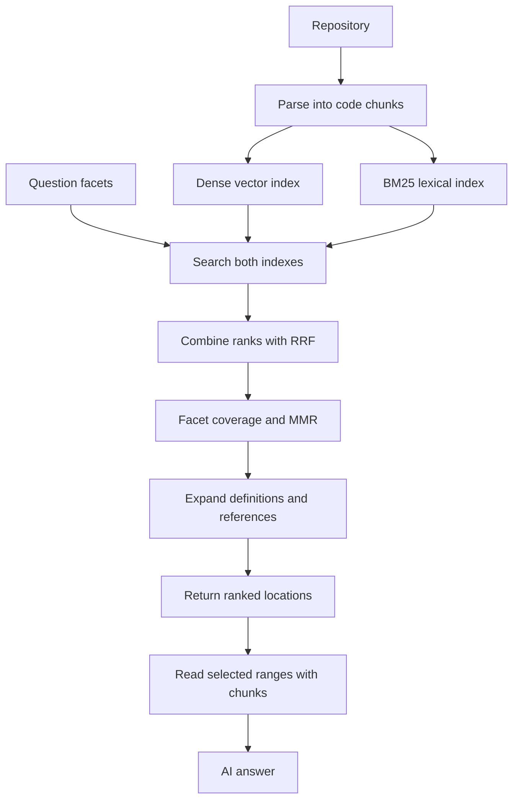

# Smritikosh Hybrid Search Pipeline

Smritikosh indexes source code once, then answers a question with a compact
table of the code locations worth reading. The objective is to preserve
grep-like coverage while reducing tool calls, repeated context, latency, and
cost.

The CLI is two commands: `explore search` ranks locations, and
`explore chunks --range` reads the ones the caller selects.



## Indexing

The indexing pipeline parses supported files with tree-sitter and creates
chunks aligned to classes, functions, methods, sections, or regex boundaries.
Oversized definitions are split into overlapping model-sized windows.

Each chunk has:

- A location-aware ID derived from path, source range, and text. Identical code
  in different files or locations cannot overwrite another chunk.
- A text-only content hash retained independently from storage identity.
- Path, source range, symbol, chunk kind, and source text.

Every chunk is written to two indexes in the same DuckDB database:

- The dense index stores the local embedding vector and finds conceptually
  similar code.
- The BM25 index stores document lengths and term frequencies and finds exact
  identifiers, paths, errors, and uncommon technical vocabulary.

The code tokenizer retains full identifiers and also splits paths,
`snake_case`, and `camelCase`. BM25 postings are updated or deleted alongside
chunks, so indexing remains incremental after the initial full rebuild.

## Query facets

A complex question is supplied as several focused facets:

```text
feature trigger and flow
failure and retry behavior
persistence and duplicate handling
relevant tests
```

Smritikosh infers a shared codebase-backed topic phrase from the first facet and
adds it to facets that omit the domain. It does not invent new facets with an
LLM.

## Candidate generation and RRF

Each facet independently retrieves candidates from dense search and BM25.
Documentation is excluded unless explicitly requested. Generated, vendor, and
agent-memory paths are excluded by default.

Dense cosine scores and BM25 scores are not directly comparable. Reciprocal
Rank Fusion combines positions instead:

```text
RRF score = sum(1 / (60 + rank))
```

Split windows of the same `(path, symbol, chunk kind)` count as one vote per
channel and facet. This prevents large definitions from gaining artificial
weight merely because they were split into several chunks.

Small metadata priors are applied after fusion:

- Topic-path agreement receives a configurable boost.
- Unrequested documentation, migrations, and unrelated tests receive modest
  configurable penalties.

The original channel ranks and per-facet contributions remain separate.

## Facet coverage and MMR

The selector first reserves the strongest candidate for every requested facet.
Additional seeds use Maximal Marginal Relevance:

```text
utility = 70% fused relevance - 30% similarity to selected candidates
```

Similarity uses code-aware token overlap. This avoids returning several
near-identical methods from one file. Selection defaults to sixteen seeds and
at most two seeds from the same file.

## Generic expansion

Selected windows are expanded into complete classes, functions, or methods.
Smritikosh then performs one bounded lexical-reference hop:

- Extract direct calls and decorators from selected source.
- Resolve exact definitions.
- Prefer definitions near the caller.
- Cache repeated definition and outline lookups.
- Rank dependencies by generic query-term agreement.

These are lexical references, not verified graph edges. A future graph
retriever can implement the same candidate port without changing fusion,
selection, or the CLI.

## Result shape

`explore search` returns locations, never source. Two TOON tables carry the
whole response: the queries with their ids, and one row per selected
definition.

```text
queries[3]{id,query}:
  Q1,feature trigger and flow
  Q2,failure and retry behavior
  Q3,relevant tests
search_results[3]{path,start_line,end_line,symbol,facets}:
  src/report/worker.py,40,88,run_daily_report,Q1
  src/report/retry.py,12,34,retry_with_backoff,Q2
  tests/report/test_worker.py,18,52,test_retries_once,Q3
```

Facets are labelled by query id so no row repeats the query text it matched,
and nothing else is emitted: no source, scores, chunk ids, coverage summary, or
truncation flags. A caller that wants code copies a row's path and range into
`explore chunks --range PATH START END`, which returns numbered source for
exactly the spans it asked for.

`--max-results` is clamped to a tested maximum rather than failing or letting an
agent inflate output.

## Ports and adapters

- `smritikosh/ports/retrieval.py` defines candidate, source-reader, and lexical
  store contracts.
- `smritikosh/adapters/retrieval/source.py` reads indexed source from DuckDB.
- `smritikosh/adapters/retrieval/duckdb.py` implements dense and BM25 adapters.
- `smritikosh/retrieval/hybrid.py` generates candidates per facet.
- `smritikosh/retrieval/fusion.py` implements RRF.
- `smritikosh/retrieval/priors.py` applies configurable metadata priors.
- `smritikosh/retrieval/selection.py` implements facet reservation and MMR.
- `smritikosh/retrieval/expansion.py` performs generic bounded expansion.
- `smritikosh/retrieval/service.py` coordinates the application flow and returns
  `SearchLocation` values.
- `smritikosh/exploration_cli.py` only parses commands, constructs adapters, and
  renders TOON output.

No feature-specific report, Redis, idempotency, cron, or repository path is
hardcoded into the retrieval strategy.

## Usage

```bash
smritikosh index /path/to/repo \
  --db-path smritikosh.duckdb \
  --full

smritikosh explore search \
  "feature trigger and flow" \
  "failure and retry behavior" \
  "persistence and duplicate handling" \
  "relevant tests" \
  --db-path smritikosh.duckdb

smritikosh explore chunks \
  --range src/report/worker.py 40 88 \
  --range src/report/retry.py 12 34 \
  --db-path smritikosh.duckdb
```
