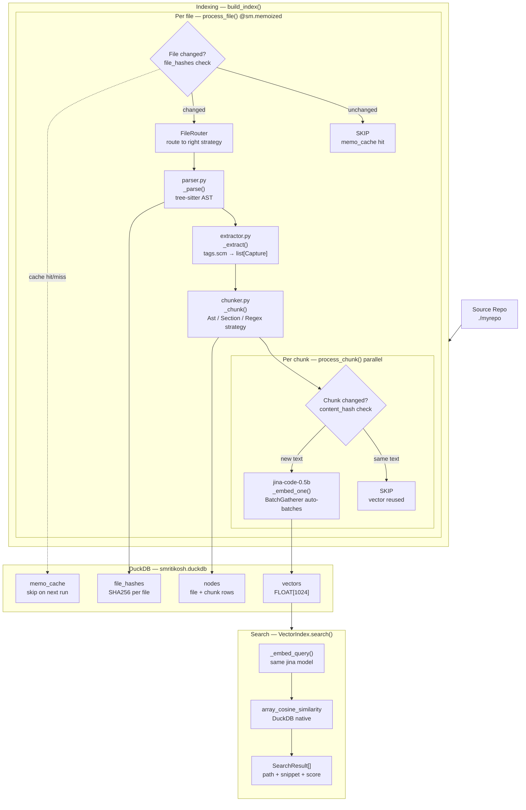

# smritikosh v1.0 — Vector Store

**Goal:** `smritikosh index ./myrepo` + `smritikosh search "query"` — semantic code search with incremental re-indexing, zero API keys required by default.

---

## System overview



---

## DuckDB schema — v1 (4 tables)

```sql
CREATE TABLE nodes (
    id          TEXT PRIMARY KEY,   -- sha256-based stable ID
    kind        TEXT NOT NULL,      -- "file" | "chunk"
    name        TEXT,
    path        TEXT,
    metadata    JSON,               -- {text, chunk_kind, symbol_ids, start_line, end_line, content_hash}
    updated_at  TIMESTAMP DEFAULT now()
);

CREATE TABLE vectors (
    chunk_id    TEXT PRIMARY KEY,   -- references nodes.id where kind="chunk"
    vector      FLOAT[1024],        -- dims from embedder.dims, set at VectorStore.setup()
    updated_at  TIMESTAMP DEFAULT now()
);

CREATE TABLE file_hashes (
    path        TEXT PRIMARY KEY,
    hash        TEXT NOT NULL,      -- sha256(file content) — drives incremental diff
    indexed_at  TIMESTAMP DEFAULT now()
);

CREATE TABLE memo_cache (
    component_path  TEXT NOT NULL,  -- "process_file/billing/invoices.py"
    cache_key       TEXT NOT NULL,  -- sha256(logic_fp | input_fp | context_fp)
    result          BLOB,
    created_at      TIMESTAMP DEFAULT now(),
    PRIMARY KEY (component_path, cache_key)
);
```

---

## Key design decisions

| Decision | Choice | Why |
|---|---|---|
| File routing | `FileRouter` + `JsonExcludeFilter` | OCP: new language = 1 `register_extension()` call |
| Chunking | Strategy Pattern (`Ast`/`Section`/`Regex`) | SRP: each strategy owns its algorithm |
| Incremental (file) | `@sm.memoized` + `file_hashes` | Skip unchanged files entirely |
| Incremental (chunk) | `content_hash` = chunk ID | Same text = same ID = `vector_store.exists()` = skip embed |
| Embedding model | `jinaai/jina-code-embeddings-0.5b` | Free, 1024 dims, beats voyage-code-3 on MTEB Code |
| Batching | `@sm.batched(max_size=32)` + `BatchGatherer` | 8 chunks → 1 API call; auto-retry on token limit |
| Vector storage | `DuckDB FLOAT[dims]` + `array_cosine_similarity` | No FAISS dependency; same file as graph data |
| Dims change | `VectorStore.setup()` drops + recreates vectors table | Model switch fully handled |

---

## Files — v1 (15 files: 8 new, 7 edited)

### NEW: `smritikosh/queries/`
Bundle of 7 `tags.scm` files shipped inside the pip package. Loaded via `importlib.resources` — no runtime fetching.

| Language | File | Key additions over official |
|---|---|---|
| Python | `queries/python/tags.scm` | `async_function_definition`, `annotated_assignment`, all enum styles (str+Enum, StrEnum, enum.Enum), `class_init` (__init__), `class_constant` |
| Java | `queries/java/tags.scm` | `constructor_declaration` as `class_init`, `enum_declaration`, `static final` constants |
| Kotlin | `queries/kotlin/tags.scm` | `enum class`, `secondary_constructor` as `class_init` |
| TypeScript | `queries/typescript/tags.scm` | `class_declaration`, `function_declaration`, `arrow_function`, `enum_declaration`, `constructor` as `class_init` |
| JavaScript | `queries/javascript/tags.scm` | `constructor` as `class_init`, module-level `const` |
| Markdown | `queries/markdown/tags.scm` | Custom: `atx_heading` + `setext_heading` → `@definition.section` |
| JSON | `queries/json/tags.scm` | Custom: top-level object keys → `@definition.section` |

TOML: **no tags.scm** — uses `RegexChunkingStrategy` (split at `^\[+[^\]]+\]`).

---

### NEW: `smritikosh/engine.py`

The incremental processing engine. CocoIndex patterns in plain Python.

**Classes:**
- `PipelineContext` — holds all `ContextKey` values for one run. Used as `with ctx:` context manager.
- `ContextKey[T](name, detect_change=False)` — named slot for a shared resource
- `MemoizationStore` — DuckDB `memo_cache` table. `get(component_path, cache_key)`, `set(...)`, `delete_component(...)`
- `FunctionDecorator` — implements `@sm.memoized` (`memo=True`) and `@sm.tracked` (`memo=False`)
- `AsyncWrapper` — implements `@sm.threaded` and `@sm.batched(max_size)`
- `BatchGatherer` — collects concurrent single-item calls; fires when `max_size` hit OR after ~1ms window
- `IncrementalEngine` — the `sm` object

**Decorators / methods:**
- `@sm.memoized` — caches result by `sha256(fn_source | input_args | detect_change_context)`; skips fn body on hit
- `@sm.tracked` — participates in logic fingerprinting; NO caching; propagates source hash to memoized callers
- `@sm.threaded` — wraps sync fn in `asyncio.to_thread()`; releases event loop (tree-sitter releases GIL → true parallelism)
- `@sm.batched(max_size=N)` — external: `async str → list[float]`; internal: `list[str] → list[list[float]]`; `RetryWithSmallerBatch` halves on error
- `sm.gather(fn, items)` — `asyncio.gather` within current component; no new memo boundary
- `sm.fan_out(fn, items)` — one component path per item (`"{fn.__name__}/{item.path}"`); all parallel

**Functions:**
- `use_context(key: ContextKey[T]) → T` — read a ContextKey inside any sm-decorated function
- `initialize_memo_store(con)` — must be called in `build_index()` before `asyncio.run()`
- `RetryWithSmallerBatch` — exception raised inside `@sm.batched` fn to trigger halving

---

### NEW: `smritikosh/embedder.py`

```python
class Embedder(ABC):
    @property
    def dims(self) -> int: ...          # drives VectorStore.setup(dims)
    @property
    def model_id(self) -> str: ...      # detect_change=True — model switch invalidates all memos
    async def embed_document(self, text: str) -> list[float]: ...
    async def embed_query(self, text: str) -> list[float]: ...
    async def embed_documents_batch(self, texts: list[str]) -> list[list[float]]: ...
    # Default: gather(embed_document) — override for native batch APIs (Voyage, Cohere)

class SentenceTransformerEmbedder(Embedder):
    # Default: "jinaai/jina-code-embeddings-0.5b" — free, 1024 dims, CPU/GPU
    # Uses task-specific prefixes for embed_document vs embed_query

class VoyageCodeEmbedder(Embedder):   # stub — voyage-code-4, $0.12/1M
class OpenAIEmbedder(Embedder):       # stub — text-embedding-3-small, $0.02/1M
```

**Upgrade path:** `build_index(repo_path, embedder=VoyageCodeEmbedder())` — one argument change.

---

### NEW: `smritikosh/storage.py`

```python
class StorageAdapter(ABC):
    def upsert_file_node(self, source: SourceFile) -> None: ...
    def upsert_chunk_nodes(self, chunks: list[Chunk]) -> None: ...
    def delete_chunk_node(self, chunk_id: str) -> None: ...
    def get_chunk_ids_for_file(self, path: str) -> set[str]: ...
    def get_all_file_paths(self) -> set[str]: ...
    def get_file_hash(self, path: str) -> str | None: ...
    def set_file_hash(self, path: str, hash: str) -> None: ...
    def delete_file(self, path: str) -> None: ...   # nodes + file_hash in one transaction
    def get_chunks_by_ids(self, chunk_ids: list[str]) -> list[dict]: ...

class DuckDBAdapter(StorageAdapter):
    def __init__(self, db_path: str = "smritikosh.duckdb"): ...
    # con: duckdb.Connection shared with MemoizationStore and DuckDBVectorStore
```

---

### NEW: `smritikosh/vector_store.py`

```python
class VectorStore(ABC):
    def setup(self, dims: int) -> None: ...
    # If stored_dims != dims: DROP TABLE vectors → recreate with FLOAT[dims]
    # Also wipes file_hashes + memo_cache (forces full re-embed)

    def upsert(self, chunk_id: str, vector: list[float]) -> None: ...
    def search(self, query_vector: list[float], top_k: int) -> list[tuple[str, float]]: ...
    # Returns [(chunk_id, cosine_score)] sorted desc

    def delete(self, chunk_id: str) -> None: ...
    def exists(self, chunk_id: str) -> bool: ...
    def get_stored_dims(self) -> int | None: ...

class DuckDBVectorStore(VectorStore):
    # uses array_cosine_similarity(vector, ?) native DuckDB function
    # shares same .duckdb file as DuckDBAdapter

class PostgresVectorStore(VectorStore): ...  # stub — pgvector vector(dims)
class LanceDBVectorStore(VectorStore): ...   # stub
class QdrantVectorStore(VectorStore): ...    # stub
```

---

### EDIT: `smritikosh/models/__init__.py`

```python
@dataclass
class Capture:
    capture_name: str   # "definition.function", "definition.class", "definition.section"
    node: Any           # tree-sitter Node (.start_byte, .end_byte, .text)
    name: str           # text of @name capture (e.g. "ainvoke_agent")
    path: str           # source file path

@dataclass
class SourceFile:
    path:         str
    language:     str               # "python", "markdown", "json", "toml"
    content:      str
    has_tags_scm: bool              # whether extractor should run tags.scm
    strategy:     ChunkingStrategy  # the chunking strategy for this file

    @property
    def chunking_mode(self) -> str:
        return self.strategy.mode_name  # "ast" | "section" | "regex"
        # used in @sm.memoized input fingerprint — stable string, not memory address

@dataclass
class Symbol:
    id:         str           # sha256(path + name + kind)[:16]
    name:       str
    kind:       str           # constant | enum | class | method | function | ...
    path:       str
    start_line: int
    end_line:   int
    parent:     str | None    # parent Symbol.id — None = module-level

@dataclass
class ParsedFile:
    path:     str
    language: str
    content:  str             # raw text — needed by chunker for line slicing
    tree:     Any             # tree-sitter Tree

@dataclass
class Chunk:
    id:           str         # sha256(text)[:16] — content-addressed, stable
    path:         str
    start_line:   int
    end_line:     int
    text:         str
    chunk_kind:   str         # "ast" | "section" | "regex" (from strategy.mode_name)
    content_hash: str         # sha256(text) — memoization key

@dataclass
class SearchResult:
    path:        str
    start_line:  int
    end_line:    int
    snippet:     str
    score:       float
    chunk_kind:  str | None = None
```

---

### NEW: `smritikosh/indexing/file_router.py`

```python
@dataclass
class RouteConfig:
    language:     str               # tree-sitter grammar name
    strategy:     ChunkingStrategy
    has_tags_scm: bool

class JsonExcludeFilter:
    """Excludelist model: all .json indexed EXCEPT known noise."""
    DEFAULT_EXCLUDE_FILENAMES = frozenset({"package-lock.json", "yarn.lock", ...})
    DEFAULT_EXCLUDE_FILENAME_PATTERNS = ("*-lock.json", "*.min.json", ...)
    DEFAULT_EXCLUDE_DIR_SEGMENTS = frozenset({"__fixtures__", "fixtures", "coverage", ...})
    def is_excluded(self, path: str) -> bool: ...

class FileRouter:
    """OCP: new file type = register_extension() call. No other changes."""
    def register_extension(self, ext, language, strategy, has_tags_scm=True): ...
    def register_filename(self, filename, language, strategy, has_tags_scm=True): ...
    def route(self, path: str) -> RouteConfig | None:
        # JSON: JsonExcludeFilter.is_excluded() checked first
        # Filename routes take priority over extension routes
```

---

### NEW: `smritikosh/indexing/chunking_strategy.py`

```python
class ChunkingStrategy(Protocol):
    mode_name: str          # stable string for @sm.memoized fingerprint
    def chunk(self, parsed: ParsedFile, captures: list[Capture]) -> list[Chunk]: ...

class AstChunkingStrategy:
    mode_name = "ast"

    CAPTURE_PRIORITY = {
        "definition.class_init": 10, "definition.enum": 9,
        "definition.class_constant": 8, "definition.constant": 7,
        "definition.class": 6, "definition.interface": 6, "definition.module": 6,
        "definition.function": 5, "definition.method": 5,
        "definition.type": 4,
    }
    # Same node.id + two captures → higher priority wins (e.g. enum beats class)

    CHUNK_GROUPING = {
        "definition.constant":       "group",      # all module constants → ONE chunk
        "definition.class_constant": "group",      # class-body UPPER_CASE → ONE chunk
        "definition.enum":           "whole",      # full enum → ONE chunk
        "definition.class":          "with_init",  # class + constructor → ONE chunk
        "definition.class_init":     "skip",       # absorbed into class chunk
        "definition.function":       "own",
        "definition.method":         "own",
        "definition.interface":      "whole",
        "definition.module":         "whole",
        "definition.type":           "own",
    }
    # with_init: finds @definition.class_init node by byte range inside class node
    # Language-agnostic: Python __init__, TS constructor, Java constructor_declaration

class SectionChunkingStrategy:
    mode_name = "section"
    # Each @definition.section capture → own chunk
    # Used for: Markdown (headings), JSON (top-level keys)

class RegexChunkingStrategy:
    mode_name = "regex"
    def __init__(self, split_pattern: str): ...
    # Used for: TOML (split at ^\[+[^\]]+\])
    # captures=[] always — regex ignores tree-sitter output
```

---

### EDIT: `smritikosh/indexing/parser.py`

```python
DEFAULT_EXCLUDE_DIRS = frozenset({
    ".venv", "venv", ".tox", ".git", "__pycache__", ".mypy_cache",
    "node_modules", "dist", "build", "htmlcov", ".pytest_cache",
    "coverage", ".cache", ".next", "target",
})

def iter_source_files(repo_path: str, router: FileRouter) -> Iterator[SourceFile]:
    """Three sequential gates — routing happens here, never repeated downstream."""
    for file_path in Path(repo_path).rglob("*"):
        if not file_path.is_file(): continue
        parts = file_path.relative_to(repo_path).parts
        if any(p in DEFAULT_EXCLUDE_DIRS for p in parts): continue  # Gate 1
        rel = str(file_path.relative_to(repo_path))
        if gitignore_spec and gitignore_spec.match_file(rel): continue  # Gate 2
        route_config = router.route(rel)
        if route_config is None: continue  # Gate 3: unknown ext OR excluded JSON
        content = file_path.read_text(errors="replace")
        yield SourceFile(
            path=rel, language=route_config.language, content=content,
            has_tags_scm=route_config.has_tags_scm, strategy=route_config.strategy,
        )

def parse_file(source: SourceFile) -> ParsedFile:
    """CPU-bound — called via @sm.threaded. tree-sitter C extension releases GIL → true parallelism."""
    parser = _get_parser(source.language)  # cached per language
    tree   = parser.parse(source.content.encode("utf-8"))
    return ParsedFile(path=source.path, language=source.language,
                      content=source.content, tree=tree)
```

---

### EDIT: `smritikosh/indexing/extractor.py`

```python
@sm.tracked
def _extract(parsed: ParsedFile, has_tags_scm: bool) -> list[Capture]:
    """Run tags.scm query → list[Capture].
    Returns [] when has_tags_scm=False (TOML — regex chunker handles it, no query needed)."""
    if not has_tags_scm:
        return []
    query = _load_query(parsed.language)  # importlib.resources + _QUERY_CACHE
    matches = tree_sitter.QueryCursor(query).matches(parsed.tree.root_node)
    captures = []
    for _, capture_dict in matches:
        name_nodes = capture_dict.get("name", [])
        if not name_nodes: continue
        for cap_name, cap_nodes in capture_dict.items():
            if cap_name.startswith("definition.") or cap_name == "reference.call":
                captures.append(Capture(
                    capture_name=cap_name,
                    node=cap_nodes[0] if isinstance(cap_nodes, list) else cap_nodes,
                    name=name_nodes[0].text.decode(),
                    path=parsed.path,
                ))
    return captures

def _load_query(language: str) -> tree_sitter.Query:
    if language not in _QUERY_CACHE:
        ref = importlib.resources.files("smritikosh.queries") / language / "tags.scm"
        src = ref.read_text(encoding="utf-8")
        lang_obj = get_language(language)
        _QUERY_CACHE[language] = tree_sitter.Query(lang_obj, src)
    return _QUERY_CACHE[language]
```

---

### EDIT: `smritikosh/indexing/chunker.py`

```python
@sm.tracked
def _chunk(parsed: ParsedFile, captures: list[Capture], strategy: ChunkingStrategy) -> list[Chunk]:
    """Delegate to the right ChunkingStrategy.
    @sm.tracked: AstChunkingStrategy code change → this fn's fingerprint changes
    → @sm.memoized process_file gets cache miss → all files re-chunk."""
    return strategy.chunk(parsed, captures)
```

Internal helpers in `chunker.py` used by strategies:
- `_deduplicate_by_priority(captures, priority_dict)` — same node.id → keep highest priority capture
- `_apply_grouping(parsed, captures, grouping_dict)` — apply group/whole/with_init/own/skip strategies
- `_find_class_init(captures, class_node, skip)` — byte-range lookup for constructor node
- `_make_group_chunk(parsed, nodes, chunk_kind)` — concatenate node texts
- `_make_node_chunk(parsed, node, chunk_kind)` — single node text
- `_make_text_chunk(parsed, text, chunk_kind, start_line, end_line)` — from raw text

---

### EDIT: `smritikosh/indexing/vector_index.py`

```python
class VectorIndex:
    def __init__(self, vector_store: VectorStore, storage: StorageAdapter, embedder: Embedder): ...

    async def search(self, query: str, top_k: int = 10) -> list[SearchResult]:
        query_vector = await self.embedder.embed_query(query)
        hits = self.vector_store.search(query_vector, top_k)   # [(chunk_id, score)]
        chunk_metas = self.storage.get_chunks_by_ids([h[0] for h in hits])
        return [SearchResult(path=m["path"], start_line=m["start_line"],
                             end_line=m["end_line"], snippet=m["text"],
                             score=score, chunk_kind=m["chunk_kind"])
                for m, (_, score) in zip(chunk_metas, hits)]
```

---

### EDIT: `smritikosh/indexing/pipeline.py`

```python
# ── ContextKeys ───────────────────────────────────────────────────────────────
EMBEDDER     = ContextKey[Embedder]("embedder", detect_change=True)
STORAGE      = ContextKey[StorageAdapter]("storage")
VECTOR_STORE = ContextKey[VectorStore]("vector_store")

# ── CPU-bound stages ──────────────────────────────────────────────────────────
@sm.threaded
def _parse(source: SourceFile) -> ParsedFile:
    return parse_file(source)   # tree-sitter, releases GIL

# ── Per-chunk embedding ───────────────────────────────────────────────────────
@sm.batched(max_size=32)
def _embed_one(texts: list[str]) -> list[list[float]]:
    embedder = use_context(EMBEDDER)
    try:
        return embedder.encode(texts)
    except (APIError, TokenLimitError):
        raise RetryWithSmallerBatch()

@sm.tracked
async def process_chunk(chunk: Chunk) -> None:
    vector_store = use_context(VECTOR_STORE)
    if vector_store.exists(chunk.id): return  # content_hash unchanged → skip
    vector = await _embed_one(chunk.text)
    vector_store.upsert(chunk.id, vector)

# ── Per-file processing ───────────────────────────────────────────────────────
@sm.memoized
async def process_file(source: SourceFile) -> None:
    storage      = use_context(STORAGE)
    vector_store = use_context(VECTOR_STORE)

    old_ids = storage.get_chunk_ids_for_file(source.path)
    parsed   = await _parse(source)
    captures = _extract(parsed, source.has_tags_scm)
    chunks   = _chunk(parsed, captures, source.strategy)
    new_ids  = {c.id for c in chunks}

    for stale in old_ids - new_ids:             # orphan cleanup
        storage.delete_chunk_node(stale)
        vector_store.delete(stale)

    storage.upsert_file_node(source)
    storage.upsert_chunk_nodes(chunks)
    await sm.gather(process_chunk, chunks)

    # Write file hash AFTER success — used for deletion detection next run
    storage.set_file_hash(source.path, sha256(source.content.encode()).hexdigest())

# ── Root orchestrator ─────────────────────────────────────────────────────────
@sm.tracked
async def _run_pipeline(repo_path: str) -> None:
    storage = use_context(STORAGE)
    router  = _build_router()
    files   = list(iter_source_files(repo_path, router))

    stored_paths  = set(storage.get_all_file_paths())
    current_paths = {f.path for f in files}
    memo_store = _get_memo_store()
    for deleted in stored_paths - current_paths:
        storage.delete_file(deleted)
        memo_store.delete_component("process_file", deleted)

    await sm.fan_out(process_file, files)

# ── Router factory — only file that changes when adding a language ─────────────
def _build_router() -> FileRouter:
    ast      = AstChunkingStrategy()
    sections = SectionChunkingStrategy()
    toml     = RegexChunkingStrategy(r'^\[+[^\]]+\]')

    router = FileRouter(json_exclude_filter=JsonExcludeFilter())
    router.register_extension(".py",   "python",     ast)
    router.register_extension(".ts",   "typescript", ast)
    router.register_extension(".tsx",  "typescript", ast)
    router.register_extension(".js",   "javascript", ast)
    router.register_extension(".jsx",  "javascript", ast)
    router.register_extension(".java", "java",       ast)
    router.register_extension(".kt",   "kotlin",     ast)
    router.register_extension(".kts",  "kotlin",     ast)
    router.register_extension(".md",   "markdown",   sections)
    router.register_extension(".mdx",  "markdown",   sections)
    router.register_extension(".toml", "toml",       toml, has_tags_scm=False)
    router.register_extension(".json", "json",       sections)
    return router

# ── Public entry point — I/O backend setup only ───────────────────────────────
def build_index(
    repo_path:    str,
    embedder:     Embedder       | None = None,
    storage:      StorageAdapter | None = None,
    vector_store: VectorStore    | None = None,
) -> None:
    embedder     = embedder     or SentenceTransformerEmbedder()
    storage      = storage      or DuckDBAdapter("smritikosh.duckdb")
    vector_store = vector_store or DuckDBVectorStore("smritikosh.duckdb")

    vector_store.setup(embedder.dims)      # creates FLOAT[dims] column; drops+recreates on model change
    initialize_memo_store(storage.con)     # creates memo_cache table

    ctx = PipelineContext()
    ctx.provide(EMBEDDER,     embedder)    # detect_change=True — model switch invalidates all memos
    ctx.provide(STORAGE,      storage)
    ctx.provide(VECTOR_STORE, vector_store)

    with ctx:
        asyncio.run(_run_pipeline(repo_path))
```

---

### EDIT: `smritikosh/cli.py`

```
smritikosh index <repo_path>
  --embedder  {jina|voyage|openai}    default: jina
  --db-path   PATH                    default: smritikosh.duckdb
  --watch / -L                        stay alive, re-index on file changes (watchfiles)
  --full                              force full rebuild (clear memo_cache + file_hashes)

smritikosh search <query>
  --top-k     N                       default: 10
  --db-path   PATH                    default: smritikosh.duckdb
```

---

### EDIT: `pyproject.toml`

```toml
[project]
dependencies = [
    "click>=8.1",
    "duckdb>=0.10",
    "sentence-transformers>=3.0",
    "tree-sitter-language-pack>=0.1",   # all grammars in one package
    "pathspec>=0.12",                    # gitignore support
    "watchfiles>=0.21",                  # --watch live mode
]

[tool.setuptools.package-data]
smritikosh = ["queries/**/*.scm"]       # bundle tags.scm files in pip package

[project.optional-dependencies]
voyage   = ["voyageai>=0.3"]
openai   = ["openai>=1.0"]
postgres = ["psycopg2-binary>=2.9", "pgvector>=0.2"]
lancedb  = ["lancedb>=0.5"]
qdrant   = ["qdrant-client>=1.7"]
```

---

## Implementation order

```
1. models/__init__.py      — Capture, SourceFile, Symbol, ParsedFile, Chunk, SearchResult
2. engine.py               — PipelineContext, ContextKey, @sm.memoized/tracked/threaded/batched, sm.gather/fan_out
3. embedder.py             — Embedder ABC + SentenceTransformerEmbedder
4. storage.py              — StorageAdapter ABC + DuckDBAdapter
5. vector_store.py         — VectorStore ABC + DuckDBVectorStore
6. indexing/file_router.py — RouteConfig, FileRouter, JsonExcludeFilter
7. queries/                — tags.scm for all 7 languages
8. indexing/chunking_strategy.py — AstChunkingStrategy, SectionChunkingStrategy, RegexChunkingStrategy
9. indexing/parser.py      — iter_source_files, parse_file
10. indexing/extractor.py  — _extract, _load_query
11. indexing/chunker.py    — _chunk + internal helpers
12. indexing/vector_index.py — VectorIndex.search()
13. indexing/pipeline.py   — _build_router, process_chunk, process_file, _run_pipeline, build_index
14. cli.py                 — smritikosh index + smritikosh search
15. pyproject.toml         — deps + package-data
```
